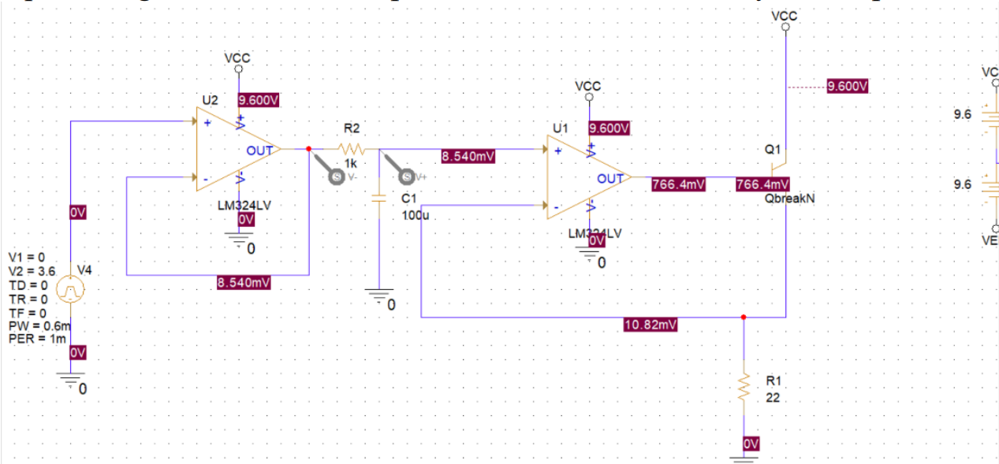

# MSP430 Heater Project

<h2>Equipment List</h2>  
MCU = MSP43062553 
LCD = TC16020 
Membrane Keypad 
I2C Module 
Resistors = 1k, 22 
Capacitor = 100u 
Jumper Cables 
BreadBoard 
9V Battery 
2N2222 Transistor 
LM324 
LM35 

Heating element in this circuit is named as R1. LM35 Should be placed very close to R1 resistance. V4 voltage source is placed to imitate PWM signal that is output of one of the MSP430g2553's pins.

In this project, Msp430 takes input from 4x3 membrane keypad. According to input it heats resistor and after reaching specified value taken from input, it stops for 10 second. Current temperature value is showed on LCD until specified value is reached.
